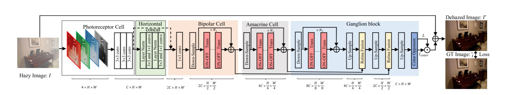

# RetinaFormer: Retina Inspired Transformer for Single Image Dehazing

[](https://pan.baidu.com/s/13mViKT6i5g0ldT69CKyofA?pwd=5ej3)
[](https://sites.google.com/view/reside-dehaze-datasets/reside-v0)
[](https://data.vision.ee.ethz.ch/cvl/ntire18//o-haze/)
[](https://data.vision.ee.ethz.ch/cvl/ntire19//dense-haze/)


## News

- **Aug 27, 2025:** Manuscript submitted to IEEE TIP.

## Overall Architecture


## Preparation

### Install

We test the code on PyTorch 2.8.0 + CUDA 12.8 + cuDNN 9.1.2.

1. Create a new conda environment
```
conda create -n pt280 python=3.10
conda activate pt280
```

2. Install dependencies
```
conda install pytorch=2.8.0 torchvision torchaudio cudatoolkit=12.8 -c pytorch
pip install -r requirements.txt
```

### Data Preparation

1. Download the dataset: [[RESIDE](https://sites.google.com/view/reside-dehaze-datasets/reside-v0)] ,  [[O-HAZE](https://data.vision.ee.ethz.ch/cvl/ntire18//o-haze/)], [[Dense haze](https://data.vision.ee.ethz.ch/cvl/ntire19//dense-haze/)].
2. Make sure the file structure is consistent with the following:

```
dataset/
├── RESIDE-6k
│   ├── test
│   |   ├── GT  
│   |   └── hazy
│   |       
│   |      
│   └── train
│       ├── GT
│       │  
│       └── hazy
├── ITS
│   ├── test
│   |   ├── GT  
│   |   └── hazy
│   |       
│   |      
│   └── train
│       ├── GT
│       │  
│       └── hazy
└── OTS
│   ├── test
│   |   ├── GT  
│   |   └── hazy
│   |       
│   |      
│   └── train
│       ├── GT
│       │  
│       └── hazy
└── O-HAZE
│   ├── test
│   |   ├── GT  
│   |   └── hazy
│   |       
│   |      
│   └── train
│       ├── GT
│       │  
│       └── hazy
└── Dense HAZE
│   ├── test
│   |   ├── GT  
│   |   └── hazy
│   |       
│   |      
│   └── train
│       ├── GT
│       │  
│       └── hazy
```

## Training and Evaluation

In order to align the folder structure of each dataset, we rearrange the original dataset.

### Train

You can modify the training settings for each experiment in the `configs` folder.
Then run the following script to train the model:

```sh
python train.py --model (model name) --dataset (dataset name) --exp (exp name)
```


### Test

Run the following script to test the trained model:

```sh
python test.py --model (model name) --dataset (dataset name) --exp (exp name)
```


## Contact
If you have any questions or suggestions about our paper and repo, please feel free to concat us .
